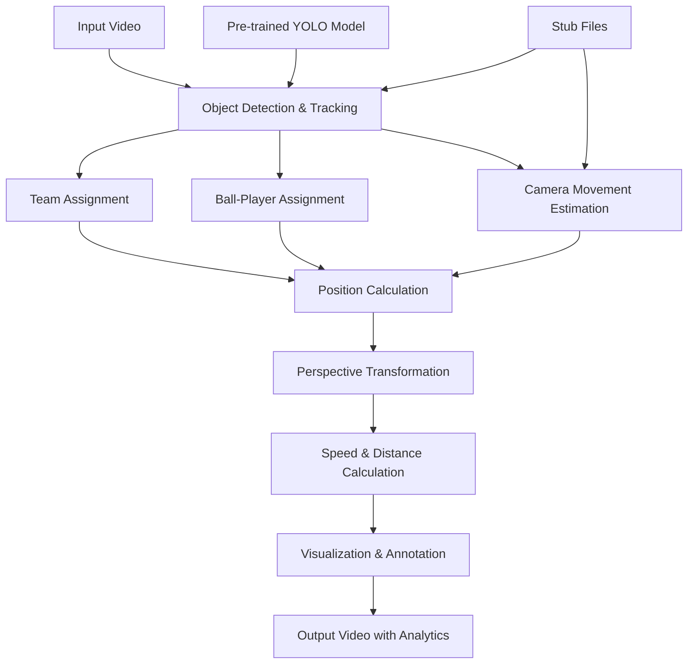

# ⚽ Football Analysis Computer Vision Project

##  Project Overview

This is an advanced computer vision system for comprehensive football match analysis using state-of-the-art AI technologies. The system performs real-time detection, tracking, and analysis of players, referees, and the ball in football videos, providing detailed insights including team assignment, ball possession, player speed tracking, and distance calculations.

###  Key Features

- **Multi-Object Detection & Tracking**: Simultaneous detection and tracking of players, referees, and ball
- **Team Classification**: Automatic team assignment using K-means clustering on jersey colors
- **Ball Possession Analysis**: Real-time ball-to-player assignment and team possession statistics
- **Speed & Distance Tracking**: Calculate player speeds (km/h) and distances covered (meters)
- **Camera Movement Compensation**: Advanced optical flow-based camera movement estimation
- **Perspective Transformation**: Convert pixel coordinates to real-world field coordinates
- **Real-time Visualization**: Comprehensive overlay annotations and statistics

##  System Architecture



## 📁 Project Structure

### Core Components

#### `main.py`
**Main orchestration script** that coordinates all components:
- Video input/output handling
- Component initialization and sequencing
- Data flow management between modules
- Error handling and validation

#### `trackers/`
**Object Detection & Tracking Module**
- `tracker.py`: Core tracking implementation using YOLO + ByteTrack
- **Why needed**: Provides consistent object identification across frames
- **Challenges tackled**:
  - Multiple object detection in cluttered scenes
  - Maintaining track IDs despite occlusions
  - Ball interpolation for missed detections

#### `team_assigner/`
**Team Classification System**
- `team_assigner.py`: K-means clustering for jersey color analysis
- **Why needed**: Distinguish between two teams automatically
- **Challenges tackled**:
  - Varying lighting conditions
  - Jersey color similarity
  - Player occlusion affecting color extraction

#### `player_ball_assigner/`
**Ball Possession Analysis**
- `player_ball_assigner.py`: Distance-based ball-to-player assignment
- **Why needed**: Determine which player has ball control
- **Challenges tackled**:
  - Fast ball movement between players
  - Multiple players in close proximity
  - Ball visibility issues

#### `camera_movement_estimator/`
**Camera Motion Compensation**
- `camera_movement_estimator.py`: Optical flow-based camera tracking
- **Why needed**: Compensate for camera panning/zooming in position calculations
- **Challenges tackled**:
  - Feature point selection in crowded scenes
  - Robust motion estimation
  - Handling rapid camera movements

#### `view_transformer/`
**Coordinate System Transformation**
- `view_transformer.py`: Perspective transformation for real-world coordinates
- **Why needed**: Convert pixel positions to actual field measurements
- **Challenges tackled**:
  - Accurate field boundary detection
  - Perspective distortion correction
  - Coordinate system mapping

#### `speed_and_distance_estimator/`
**Performance Analytics**
- `speed_and_distance_estimator.py`: Real-time speed and distance calculations
- **Why needed**: Provide detailed player performance metrics
- **Challenges tackled**:
  - Frame rate normalization
  - Smooth speed calculations over time windows
  - Accumulative distance tracking

#### `utils/`
**Utility Functions**
- `video_utils.py`: Video I/O operations with error handling
- `bbox_utils.py`: Bounding box manipulation and calculations
- **Why needed**: Shared functionality across modules

### Training & Data Components

#### `training/`
**Model Training Infrastructure**
- `football_training_yolo_v5.ipynb`: YOLOv5 training notebook
- `football-players-detection-1/`: Annotated dataset
  - **612 training images** with 4 classes: ball, goalkeeper, player, referee
  - **38 validation images**
  - **13 test images**
- **Why needed**: Custom model training for football-specific object detection

#### `models/`
**Trained Model Files**
- `best.pt`: Primary trained YOLO model
- `last.pt`: Latest checkpoint
- `yolov8l.pt`: Pre-trained YOLOv8 large model
- **Why needed**: Store trained models for inference

#### `runs/`
**Training Experiment Tracking**
- Multiple training runs with metrics, confusion matrices, and validation results
- **Why needed**: Track model performance and compare experiments

### Development & Analysis

#### `development_and_analysis/`
- `color_assignment.ipynb`: Team color analysis experimentation
- **Why needed**: Prototype and test color clustering algorithms

#### `stubs/`
**Performance Optimization**
- `track_stubs.pkl`: Cached tracking results
- `camera_movement_stub.pkl`: Cached camera movement data
- **Why needed**: Avoid recomputing expensive operations during development

#### `input_videos/` & `output_videos/`
**Data Pipeline**
- Input video storage and processed output with annotations
- **Why needed**: Clear separation of source and processed data

##  Technical Implementation

### 1. Object Detection Pipeline
```python
# YOLO-based detection with ByteTrack integration
tracker = Tracker('models/best.pt')
tracks = tracker.get_object_tracks(video_frames)
```

### 2. Team Assignment Algorithm
```python
# K-means clustering on jersey colors
team_assigner = TeamAssigner()
team_assigner.assign_team_color(frame, player_detections)
```

### 3. Ball Possession Logic
```python
# Distance-based assignment with threshold
player_assigner = PlayerBallAssigner()
assigned_player = player_assigner.assign_ball_to_player(players, ball_bbox)
```

### 4. Camera Movement Compensation
```python
# Optical flow-based motion estimation
camera_estimator = CameraMovementEstimator(first_frame)
movement = camera_estimator.get_camera_movement(frames)
```

##  Key Challenges & Solutions

### Challenge 1: Multi-Object Tracking in Complex Scenes
**Problem**: Maintaining consistent player identities across frames with occlusions
**Solution**: 
- YOLO for robust detection + ByteTrack for association
- Goalkeeper-to-player class mapping for uniform handling
- Track interpolation for temporary losses

### Challenge 2: Team Differentiation
**Problem**: Distinguishing teams with similar jersey colors
**Solution**:
- K-means clustering on top-half of player crops
- Corner pixel analysis to separate player from background
- Consistent team ID assignment across frames

### Challenge 3: Ball Possession Analysis
**Problem**: Accurate ball-to-player assignment with fast movements
**Solution**:
- Distance-based assignment with configurable thresholds
- Multi-point distance calculation (left/right foot positions)
- Temporal consistency in possession tracking

### Challenge 4: Camera Movement Impact
**Problem**: Camera panning affects position-based calculations
**Solution**:
- Lucas-Kanade optical flow on selected feature points
- Robust feature selection in stable image regions
- Movement compensation for all tracked objects

### Challenge 5: Real-World Coordinate Mapping
**Problem**: Converting pixel coordinates to field measurements
**Solution**:
- Perspective transformation using field boundary points
- Manual calibration for accurate mapping
- Boundary validation for transformed coordinates

### Challenge 6: Performance Optimization
**Problem**: Real-time processing requirements
**Solution**:
- Batch processing for detection (20 frames/batch)
- Stub file caching for development
- Efficient numpy operations for calculations

##  Usage

### Prerequisites
```bash
pip install ultralytics supervision opencv-python scikit-learn pandas numpy
```

### Basic Usage
```python
python main.py
```

### Custom Configuration
```python
# Modify paths in main.py
input_path = 'your_video.mp4'
output_path = 'analyzed_output.avi'
model_path = 'models/your_model.pt'
```

##  Performance Metrics

### Model Performance
- **Detection Classes**: 4 (ball, goalkeeper, player, referee)
- **Training Images**: 612
- **Validation Accuracy**: Available in `runs/` directories
- **Inference Speed**: ~20 FPS on modern GPU

### Analysis Capabilities
- **Team Possession Tracking**: Real-time percentage calculation
- **Speed Measurement**: Accurate to 0.1 km/h
- **Distance Tracking**: Cumulative player movement in meters
- **Camera Compensation**: Sub-pixel accuracy motion estimation

##  Future Enhancements

1. **Advanced Analytics**:
   - Heat map generation
   - Pass detection and analysis
   - Formation analysis

2. **Real-time Processing**:
   - Live stream processing
   - WebRTC integration
   - Mobile app development

3. **Enhanced Accuracy**:
   - Multi-camera fusion
   - Deep learning team classification
   - Advanced ball trajectory prediction

