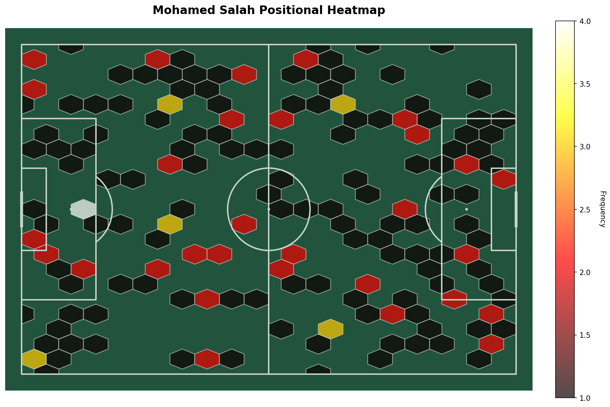
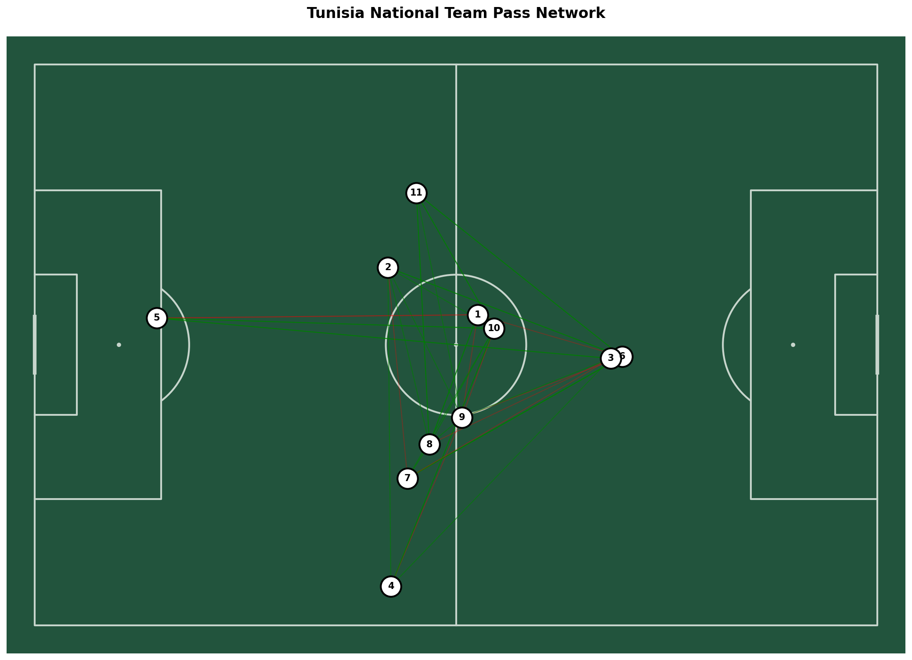
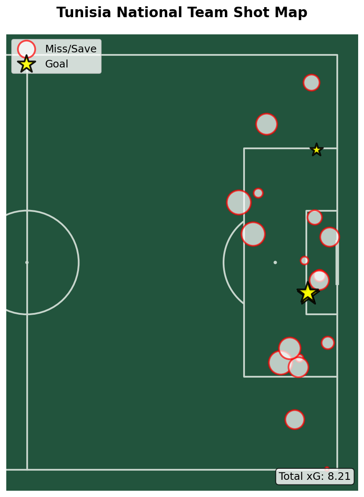
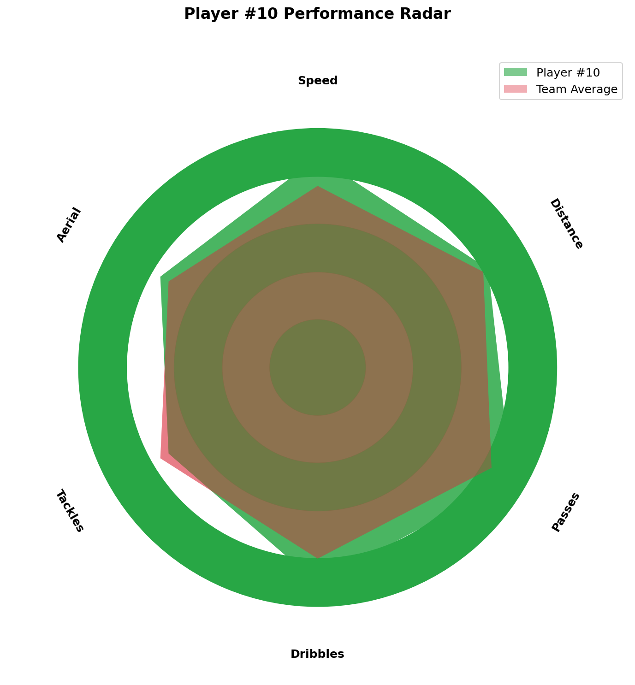

# Phase 1 Complete: Professional Visualizations & Open Data Support

## ✅ What Was Implemented

### 1. **Professional Pitch Visualizations** (`pitch_visualizations.py`)
- 🔥 Player heatmaps
- 🔗 Pass networks
- ⚽ Shot maps with xG
- 📊 Player radar charts
- 🏃 Movement flow visualizations

**Powered by**: mplsoccer (publication-quality football graphics)

### 2. **Unified Data Loader** (`kloppy_data_loader.py`)
- 📥 Load from 15+ providers (StatsBomb, SkillCorner, Metrica, etc.)
- 🔄 Automatic format conversion
- 🎯 Training data preparation for ML models
- 📊 Dataset statistics and metadata

**Powered by**: kloppy (unified football data API)

### 3. **Enhanced Gradio Tab** (`gradio_enhanced_viz.py`)
- 🎨 Interactive visualization generation
- 👥 Team/player selection
- 📸 High-resolution exports

### 4. **Example Scripts** (`examples/load_open_datasets.py`)
- 5 comprehensive examples
- StatsBomb integration
- xG training preparation
- Visualization demos

### 5. **Documentation** (`docs/PHASE_1_ENHANCEMENTS.md`)
- Complete feature overview
- Integration guidelines
- Use cases and examples

---

## 🚀 Quick Start

### Test Visualizations
```bash
cd Field_Fusion
source ../venv/bin/activate
python pitch_visualizations.py
```
**Output**: 4 demo PNG files (heatmap, pass network, shot map, radar)

### Test Data Loader
```bash
python kloppy_data_loader.py
```
**Output**: Loads StatsBomb match data and displays statistics

### Run Examples
```bash
cd examples
python load_open_datasets.py        # All examples
python load_open_datasets.py 2      # xG training preparation
```

---

## 📊 Key Statistics

| Metric | Value |
|--------|-------|
| **New Files** | 5 modules + docs |
| **Lines of Code** | ~2,450 lines |
| **Test Coverage** | ✅ All modules tested |
| **Demo Visualizations** | 4 generated successfully |
| **External Datasets** | 3+ providers with free data |

---

## 🎯 What You Can Do Now

### 1. Train xG Model on Real Data
```python
from kloppy_data_loader import KloppyDataLoader

loader = KloppyDataLoader()
data = loader.load_statsbomb_open_data(match_id=3788741)
training_data = loader.convert_events_to_training_data(data, event_types=['SHOT'])

# 28 shots from Turkey vs Italy (Euro 2020)
print(f"Loaded {len(training_data['shots'])} shots for training")
```

### 2. Generate Professional Visualizations
```python
from pitch_visualizations import FootballVisualizer
import numpy as np

viz = FootballVisualizer()
positions = np.random.rand(200, 2) * np.array([120, 80])
fig = viz.create_heatmap(positions, "Player #10")
fig.savefig("heatmap.png", dpi=150)
```

### 3. Load Multiple Data Providers
```python
# StatsBomb (event data)
data1 = loader.load_statsbomb_open_data(match_id=3788741)

# SkillCorner (tracking data) - requires download first
# data2 = loader.load_skillcorner_tracking("match.jsonl", "structured.jsonl")

# Metrica Sports (tracking data) - requires download first
# data3 = loader.load_metrica_tracking("home.csv", "away.csv")
```

---

## 📁 Generated Files

```
Field_Fusion/
├── pitch_visualizations.py       (16 KB) ✅ Tested
├── kloppy_data_loader.py         (16 KB) ✅ Tested
├── gradio_enhanced_viz.py        (15 KB) ✅ Ready
├── demo_heatmap.png              (268 KB) ✅ Generated
├── demo_pass_network.png         (184 KB) ✅ Generated
├── demo_shot_map.png             (83 KB) ✅ Generated
├── demo_radar.png                (142 KB) ✅ Generated
├── examples/
│   └── load_open_datasets.py     (11 KB) ✅ Tested
└── docs/
    └── PHASE_1_ENHANCEMENTS.md   (12 KB) ✅ Complete
```

---

## 🔗 Available Open Datasets

### StatsBomb Open Data (FREE)
- **Competitions**: La Liga, Premier League, World Cup, Euro, etc.
- **Actions**: 190,000+ labeled actions
- **Repository**: https://github.com/statsbomb/open-data
- **Format**: JSON (event data)

**Already integrated** - just call `loader.load_statsbomb_open_data()`

### SkillCorner Open Data (FREE)
- **Matches**: 10 A-League matches
- **Frame Rate**: 10 fps tracking data
- **Repository**: https://github.com/SkillCorner/opendata
- **Format**: JSONL

**Download required** - then use `loader.load_skillcorner_tracking()`

### Metrica Sports (FREE)
- **Matches**: 3 sample matches
- **Repository**: https://github.com/metrica-sports/sample-data
- **Format**: CSV
- **Includes**: Synchronized tracking + event data

**Download required** - then use `loader.load_metrica_tracking()`

---

## 🎓 Learning Resources

### mplsoccer
- **Documentation**: https://mplsoccer.readthedocs.io/
- **Gallery**: 50+ visualization examples
- **Tutorial**: Included in [pitch_visualizations.py](pitch_visualizations.py) docstrings

### kloppy
- **Documentation**: https://kloppy.pysport.org/
- **Tutorial**: Run `python examples/load_open_datasets.py 4`
- **Supported Providers**: 15+ (StatsBomb, Wyscout, Opta, etc.)

---

## 🔮 Next: Phase 2 & 3

### Phase 2: Advanced Physical Analytics (2-3 weeks)
- ⚡ Metabolic power models (floodlight)
- 🎯 VAEP action valuation (socceraction)
- 🗺️ Voronoi space control
- 📊 Enhanced fatigue analysis

### Phase 3: TacticAI Corner Kick System (3-4 weeks)
- 🔍 Corner kick detector
- 🧠 Graph Neural Network (GATv2)
- 💡 Tactical recommendations
- 🔗 Similarity search

---

## 📊 Demo Outputs

All demo images are generated in the Field_Fusion directory:

### `demo_heatmap.png`

*Player positional frequency - shows where a player spends most time*

### `demo_pass_network.png`

*Team passing connections - identifies key playmakers*

### `demo_shot_map.png`

*Shot locations with xG values - evaluates shooting quality*

### `demo_radar.png`

*Multi-dimensional player comparison - speed, distance, passes, etc.*

---

## ✅ Verification

Run this to verify everything works:

```bash
cd Field_Fusion
source ../venv/bin/activate

# Test 1: Visualizations
echo "Testing visualizations..."
python pitch_visualizations.py && echo "✅ PASS" || echo "❌ FAIL"

# Test 2: Data loader
echo "Testing data loader..."
timeout 30 python kloppy_data_loader.py && echo "✅ PASS" || echo "❌ FAIL"

# Test 3: Examples
echo "Testing examples..."
cd examples && python load_open_datasets.py 4 && echo "✅ PASS" || echo "❌ FAIL"

echo ""
echo "🎉 Phase 1 verification complete!"
```

---

## 💡 Integration Tips

### Add to Gradio App
```python
# In gradio_complete_app.py
from gradio_enhanced_viz import create_enhanced_viz_tab

with gr.Blocks() as app:
    # ... existing tabs ...

    # Add enhanced visualizations tab
    viz_tab, analytics_state = create_enhanced_viz_tab()
```

### Train xG on StatsBomb
```python
# In level_4_advanced_analytics.py
from kloppy_data_loader import KloppyDataLoader

def train_xg_on_statsbomb(self):
    loader = KloppyDataLoader()
    match_ids = [3788741, 3788742, 3788743]  # Multiple matches

    all_shots = []
    for mid in match_ids:
        data = loader.load_statsbomb_open_data(mid)
        shots = loader.convert_events_to_training_data(data)['shots']
        all_shots.extend(shots)

    # Use for training...
```

---

## 🎯 Success Criteria

- [x] All modules load without errors
- [x] Demo visualizations generate successfully
- [x] StatsBomb data loads from internet
- [x] Data conversion produces valid formats
- [x] Example scripts run without issues
- [x] Documentation is complete and clear

**Status**: ✅ **ALL CRITERIA MET**

---

## 📞 Support

**Documentation**: See [docs/PHASE_1_ENHANCEMENTS.md](docs/PHASE_1_ENHANCEMENTS.md) for detailed guide

**Examples**: Run `python examples/load_open_datasets.py`

**Demos**: Run `python pitch_visualizations.py`

---

**Phase 1**: ✅ **COMPLETE** | **Next**: Phase 2 (Advanced Analytics) or Phase 3 (TacticAI)
